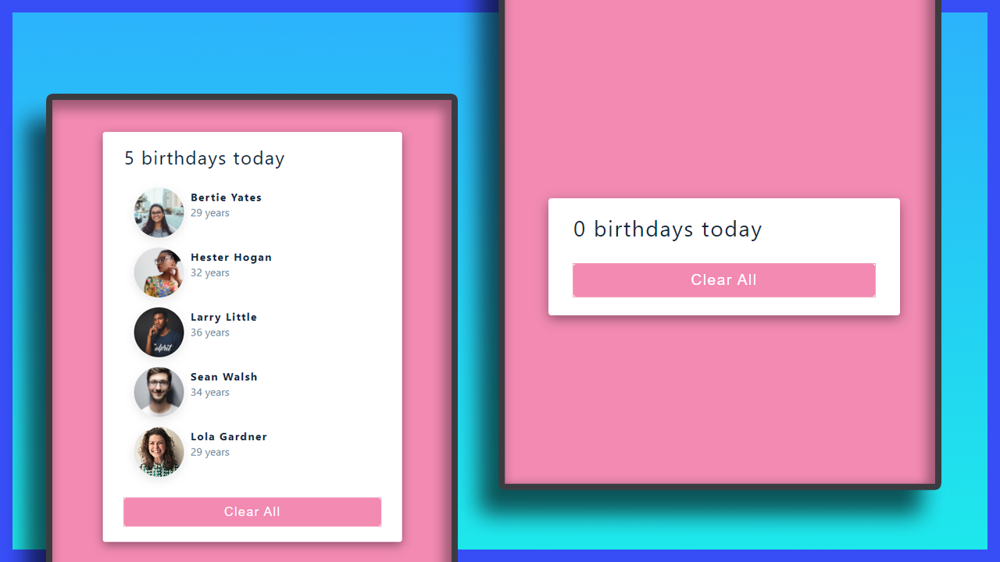

# Mini Project: Birthday Reminder

## Date: 25 - Jan - 2021

### Functions:

- Display Information of person
- Clear all persons when click on button
- Learn `useState`

### Live Site:

http://01-birthday-reminder.surge.sh/

### Screenshot



### Tech-Stack

- HTML/CSS
- React

### After this project

I have improve my knowledge about:

- review my knowledge in html/css
- learn React Hooks: `useState`

### Setup

Install dependencies

```
npm install
```

Start Project: `localhost:3000`

```
npm start
```
