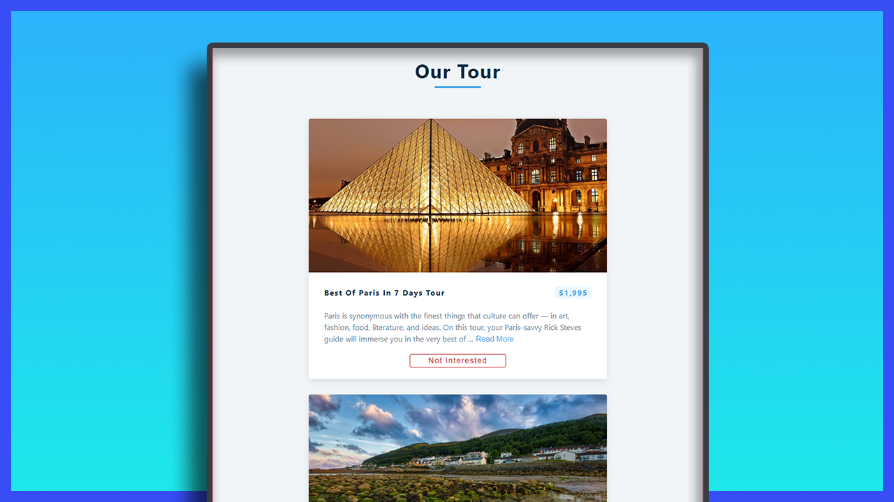

# Mini Project: Tours

## Date: 25 - Jan - 2021

### Functions:

- learn `useEffect` equal to componentDidMount
- learn connect state to children by `props`
- Fetch API
- Display Information of Tour
- Clear Tour that isn't interested when click on button

### Live Site:

http://02-tours.surge.sh/

### Screenshot



### Tech-Stack

- HTML/CSS
- React

### After this project

I have improve my knowledge about:

- review my knowledge in html/css
- learn React Hooks: `useState`, `useEffect`
- Fetch API
- State connection by `props`

### Setup

Install dependencies

```
npm install
```

Start Project: `localhost:3000`

```
npm start
```
