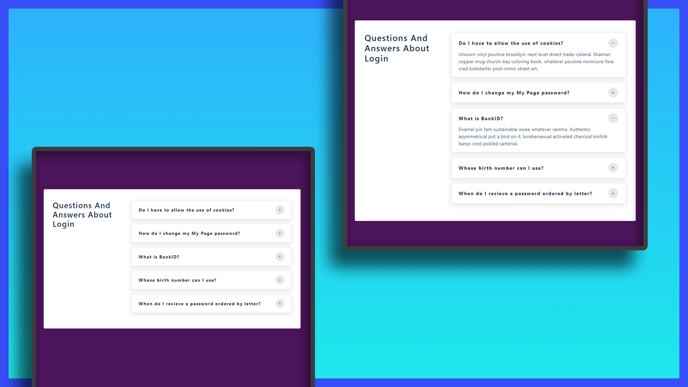

# Mini Project: Accordion

## Date: 17 - Mar - 2021

### Live Site:

http://04-accordion.surge.sh

### Screenshot



### Tech-Stack

- HTML/CSS
- React
- React-icons

### Idea

[uidesigndaily.com](https://uidesigndaily.com/posts/sketch-accordion-website-day-1175)


### After this project

I have improve my knowledge about:

- review my knowledge in html/css
- learn React Hooks: `useState`
- State connection by `props`

### Setup

Install dependencies

```
npm install
```

Start Project: `localhost:3000`

```
npm start
```
