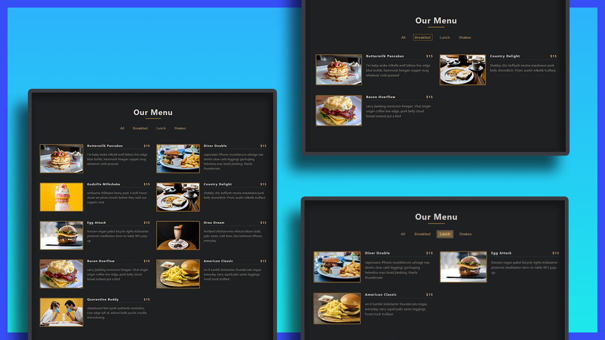

# Mini Project: Menu

## Date: 18 - Mar - 2021

### Live Site:

http://05-menu.surge.sh/

### Screenshot



### Tech-Stack

- HTML/CSS
- React

### After this project

I have improve my knowledge about:

- learn React Hooks: `useState`
- State connection by `props`
- learn `Set` object: [Set in developer.mozilla.org](https://developer.mozilla.org/en-US/docs/Web/JavaScript/Reference/Global_Objects/Set)
  - The `Set` object lets you store unique values of any type, whether primitive values or object references.
  - on this project: `Set` is **remove duplicate** elements from the array

### Setup

Install dependencies

```
npm install
```

Start Project: `localhost:3000`

```
npm start
```
