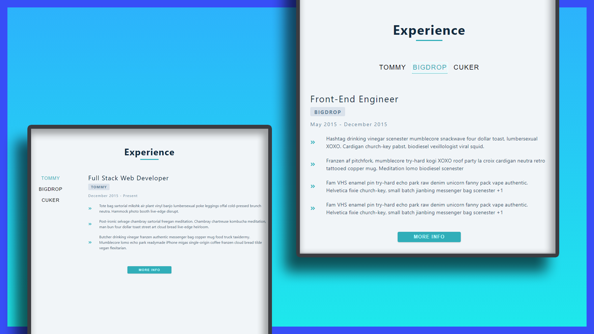

# Mini Project: Tabs

## Date: 18 - Mar - 2021

### Live Site:

http://06-tabs.surge.sh/

### Screenshot



### Tech-Stack

- HTML/CSS
- React
- React-icons

### After this project

I have improve my knowledge about:

- learn React Hooks: `useState`, `useEffect`
- fetch API

### Setup

Install dependencies

```
npm install
```

Start Project: `localhost:3000`

```
npm start
```
