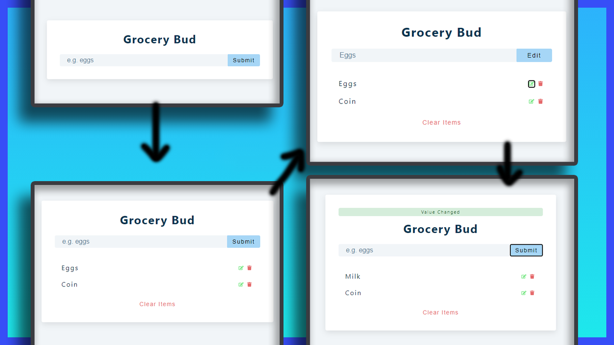

# Mini Project: Grocery Bud

## Date: 22 - Mar - 2021

### Live Site:

http://10-grocery-bud.surge.sh

### Screenshot



### Tech-Stack

- HTML/CSS
- React
- React icons

### After this project

I have improve my knowledge about:

- learn React Hooks: `useState`, `useEffect`
- useEffect for clearTimeout
- get item from LocalStorage
- handle Form Submit

### Setup

Install dependencies

```
npm install
```

Start Project: `localhost:3000`

```
npm start
```

### Deploy

1. surge install & surge login [Surge.sh](https://surge.sh/)

2. Open file `deploy-surge`
3. Update your custom domain in line 11

```
surge . [your-custom-domain].surge.sh
```

4. in cmd: run this line:

```
npm run deploy
```
