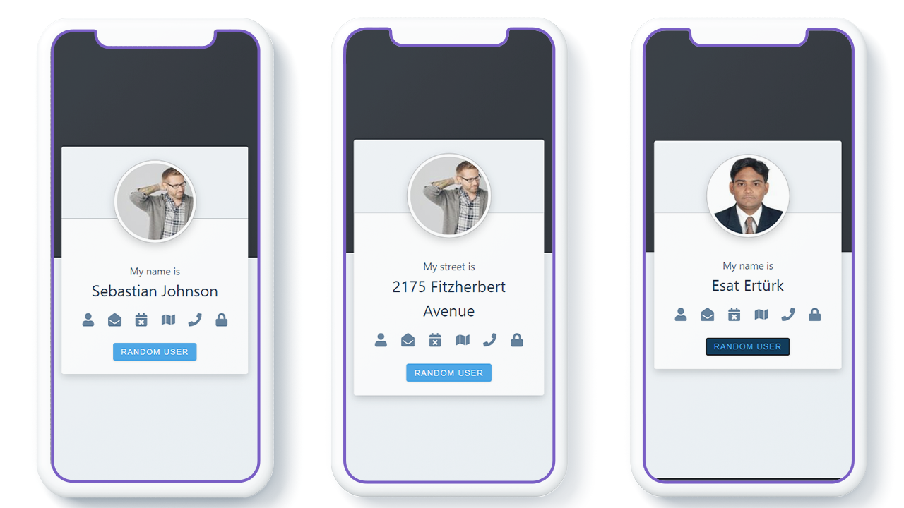

# Mini Project: Random Person

## Date: 24 - Feb - 2021

### Functions:

- Fetch API
  - Random user
- Display on Interface

### Live Site:

http://17-random-person.surge.sh

### Screenshot



### Tech-Stack

- HTML/CSS
- React

### After this project

I have improve my knowledge about:

### Setup

Install dependencies

```
npm install
```

Start Project: `localhost:3000`

```
npm start
```
